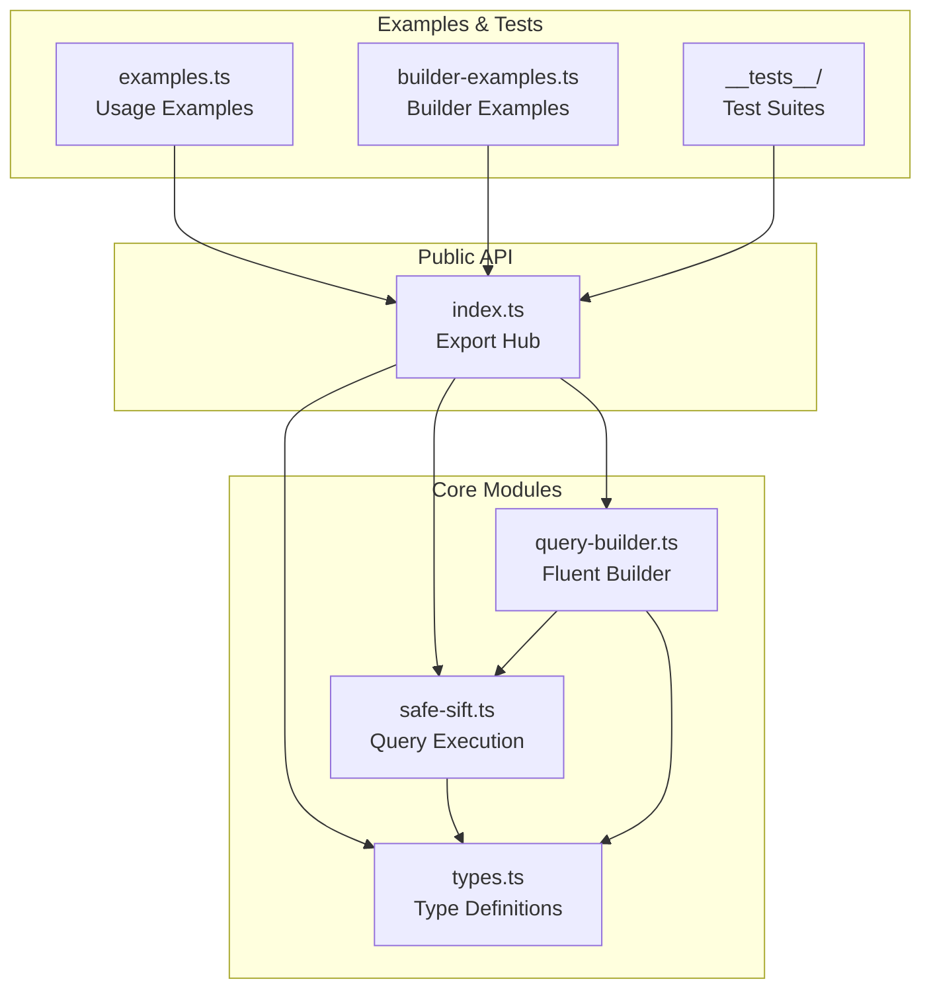
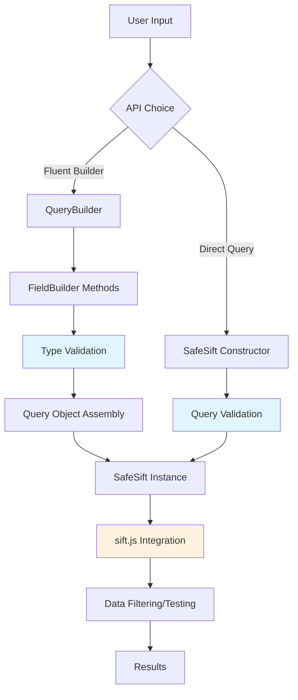
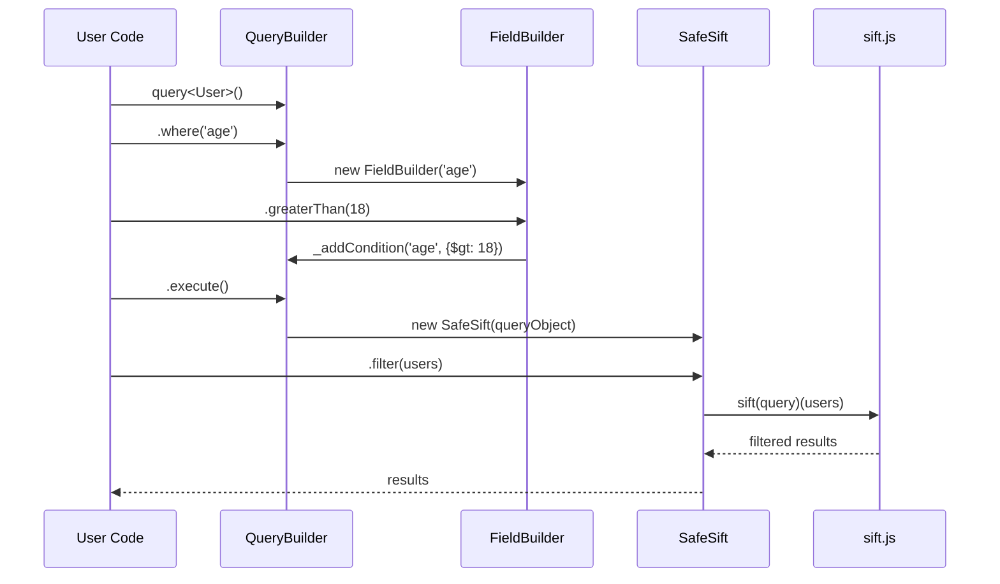
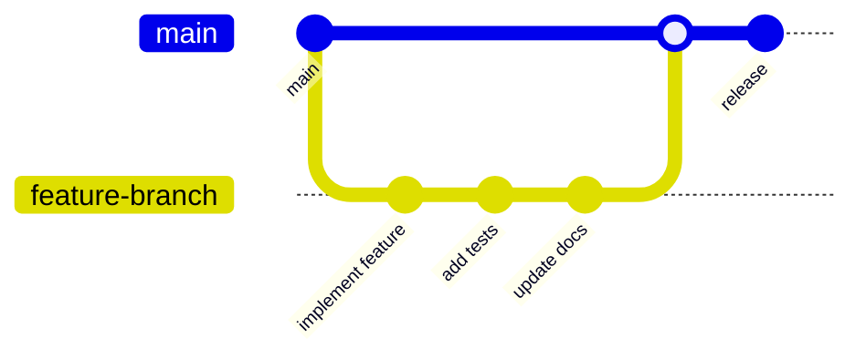

# Safe Sift - Contributor Onboarding Guide

Welcome to Safe Sift! This guide will help you understand the architecture, patterns, and development workflow of our type-safe MongoDB query wrapper.

## 📋 Table of Contents

- [Project Overview](#-project-overview)
- [Architecture](#-architecture)
- [Core Concepts](#-core-concepts)
- [Data Flow](#-data-flow)
- [Development Setup](#-development-setup)
- [Code Patterns](#-code-patterns)
- [Testing](#-testing)
- [Contributing Workflow](#-contributing-workflow)

## 🎯 Project Overview

Safe Sift is a TypeScript library that provides compile-time validation and type safety for MongoDB-style queries using [sift.js](https://github.com/crcn/sift.js). It offers two main APIs:

1. **Fluent Builder API** - Modern, chainable query building
2. **Direct Query API** - Traditional MongoDB-style query objects

### Key Features

- 🛡️ **Type Safety**: Compile-time validation against your data schema
- 🔍 **IntelliSense**: Full autocompletion for field names and operators
- 🎯 **Deep Object Support**: Type-safe nested property queries
- 📦 **Zero Dependencies**: Only depends on sift.js
- 🚀 **Performance**: No runtime overhead beyond sift.js

## 🏗️ Architecture

### Module Structure



### File Responsibilities

```
src/
├── index.ts              # Main exports & public API
├── types.ts              # TypeScript type definitions
├── safe-sift.ts          # Core query execution logic
├── query-builder.ts      # Fluent builder pattern implementation
├── examples.ts           # Usage examples for direct API
└── builder-examples.ts   # Usage examples for builder API
```

## 🧠 Core Concepts

### 1. Type Safety Architecture

The library uses advanced TypeScript features to ensure compile-time safety:

```ascii
┌─────────────────────────────────────────────────────────────┐
│                    Type Safety Stack                        │
├─────────────────────────────────────────────────────────────┤
│ DeepKeyOf<T>     │ Extract all possible field paths         │
│                  │ e.g., 'name' | 'profile.age'             │
├─────────────────────────────────────────────────────────────┤
│ DeepValueOf<T,K> │ Get value type at specific path          │
│                  │ e.g., string for 'profile.name'          │
├─────────────────────────────────────────────────────────────┤
│ SafeSiftQuery<T> │ Constrain query to valid operations      │
│                  │ Based on field types and operators       │
├─────────────────────────────────────────────────────────────┤
│ FieldBuilder<T,K>│ Type-safe field-specific operations      │
│                  │ Only allow valid ops for field type      │
└─────────────────────────────────────────────────────────────┘
```

### 2. Deep Path Type System

The library uses sophisticated type manipulation to support nested object queries:

```typescript
// DeepKeyOf<T> generates all possible dot-notation paths
interface User {
  profile: {
    preferences: {
      theme: 'light' | 'dark';
    };
  };
}

// DeepKeyOf<User> = 'profile' | 'profile.preferences' | 'profile.preferences.theme'
```

### 3. Builder Pattern Implementation

```ascii
QueryBuilder Flow:
┌──────────┐    ┌──────────────┐    ┌──────────────┐    ┌──────────┐
│ query<T> │───▶│ .where(field)│───▶│ FieldBuilder │───▶│ condition│
└──────────┘    └──────────────┘    └──────────────┘    └──────────┘
                                           │
                                           ▼
                                    ┌──────────────┐
                                    │ QueryBuilder │
                                    └──────────────┘
                                           │
                                    ┌──────▼──────┐
                                    │ .build() or │
                                    │ .execute()  │
                                    └─────────────┘
```

## 🔄 Data Flow

### Query Building and Execution Flow



### Type Checking Flow

```ascii
Input Query → TypeScript Analysis → Runtime Execution
     │              │                      │
     │              ▼                      ▼
     │         ┌──────────────┐      ┌──────────┐
     │         │ Field exists?│      │ sift.js  │
     │         │ Type valid?  │      │ filtering│
     │         │ Op supported?│      └──────────┘
     │         └──────────────┘
     │              │
     └──────────────▼
          Compile Success/Error
```

### Query Transformation Process



## 🛠️ Development Setup

### Prerequisites

- Node.js 18+
- pnpm (preferred) or npm

### Installation

```bash
git clone https://github.com/tupe12334/safe-sift
cd safe-sift
pnpm install
```

### Development Scripts

```bash
# Development
pnpm dev              # Watch mode compilation
pnpm build            # Production build

# Testing
pnpm test             # Run tests
pnpm test:ui          # Interactive test UI
pnpm test:coverage    # Coverage report

# Quality
pnpm lint             # ESLint
pnpm typecheck        # TypeScript check
```

### Project Structure

```
safe-sift/
├── src/                    # Source code
│   ├── index.ts           # Main exports
│   ├── types.ts           # Type definitions
│   ├── safe-sift.ts       # Core implementation
│   ├── query-builder.ts   # Builder pattern
│   └── examples.ts        # Usage examples
├── __tests__/             # Test files
├── dist/                  # Built files
├── package.json           # Dependencies & scripts
├── tsconfig.json          # TypeScript config
└── vitest.config.ts       # Test configuration
```

## 🎨 Code Patterns

### 1. Type-Safe Field Access Pattern

```typescript
// Pattern: Use DeepKeyOf<T> for nested field access
type PathValue<T, K extends string> = K extends DeepKeyOf<T> ? DeepValueOf<T, K> : never;

// Usage in FieldBuilder
class FieldBuilder<T, K extends DeepKeyOf<T>> {
  equals(value: PathValue<T, K>): QueryBuilder<T> {
    return this.addCondition(value);
  }
}
```

### 2. Conditional Type Operations Pattern

```typescript
// Pattern: Conditional types for operator restrictions
greaterThan(value: PathValue<T, K> extends string | number | Date ? PathValue<T, K> : never): QueryBuilder<T> {
  return this.addCondition({ $gt: value });
}

// Only allows comparison ops on comparable types
```

### 3. Method Chaining Pattern

```typescript
// Pattern: Always return QueryBuilder for chaining
private addCondition(condition: any): QueryBuilder<T> {
  this.builder._addCondition(this.field, condition, this.logical);
  return this.builder; // Enable chaining
}
```

### 4. Logical Operator Assembly Pattern

```typescript
// Pattern: Dynamic query structure based on logical operators
_addCondition(field: string, condition: any, logical?: 'and' | 'or'): void {
  if (logical === 'or') {
    // Convert to $or structure
    if (!this.query.$or) {
      const existingConditions = { ...this.query };
      // Move existing conditions into $or array
      this.query = { $or: [existingConditions, { [field]: condition }] };
    } else {
      this.query.$or.push({ [field]: condition });
    }
  }
  // ... similar logic for 'and'
}
```

### 5. Type Guards and Validation Pattern

```typescript
// Pattern: Use type predicates for runtime safety
export class SafeSift<T> {
  test(obj: T): boolean {
    return sift(this.query as Parameters<typeof sift>[0])(obj);
  }
}

// Type assertion necessary due to sift.js typing
```

## 🧪 Testing

### Test Structure

```
__tests__/
├── safe-sift.test.ts      # Core functionality tests
└── query-builder.test.ts  # Builder pattern tests
```

### Test Patterns

#### 1. Type Safety Tests

```typescript
// Test that TypeScript compilation catches errors
interface User {
  name: string;
  age: number;
}

// This should compile
const validQuery = query<User>().where('name').equals('John');

// This should NOT compile (tested via TypeScript compiler)
// const invalidQuery = query<User>().where('invalidField').equals('test');
```

#### 2. Functional Tests

```typescript
describe('QueryBuilder', () => {
  test('should build equality query', () => {
    const result = query<User>()
      .where('isActive').equals(true)
      .execute()
      .filter(testUsers);
    
    expect(result).toHaveLength(2);
    expect(result.every(user => user.isActive)).toBe(true);
  });
});
```

#### 3. Integration Tests

```typescript
// Test full query building and execution pipeline
const complexQuery = query<User>()
  .where('age').greaterThan(18)
  .and('profile.preferences.theme').equals('dark')
  .or('tags').contains('admin')
  .execute();

const results = complexQuery.filter(testData);
```

### Running Tests

```bash
# Run all tests
pnpm test

# Watch mode
pnpm test --watch

# Coverage
pnpm test:coverage

# UI mode
pnpm test:ui
```

## 🔄 Contributing Workflow

### Development Process



### Step-by-Step Contribution

1. **Fork & Clone**
   ```bash
   git clone https://github.com/your-username/safe-sift
   cd safe-sift
   pnpm install
   ```

2. **Create Feature Branch**
   ```bash
   git checkout -b feature/your-feature-name
   ```

3. **Implement Changes**
   - Follow existing code patterns
   - Maintain type safety
   - Add comprehensive tests
   - Update documentation

4. **Quality Checks**
   ```bash
   pnpm typecheck  # TypeScript validation
   pnpm lint       # Code style
   pnpm test       # All tests pass
   pnpm build      # Successful build
   ```

5. **Submit PR**
   - Clear description
   - Link related issues
   - Include test coverage
   - Update CHANGELOG.md

### Code Standards

#### TypeScript Guidelines

- **Type Safety First**: Always prefer compile-time safety over runtime flexibility
- **Generic Constraints**: Use appropriate type constraints for better IntelliSense
- **Conditional Types**: Leverage conditional types for operator restrictions
- **Documentation**: Comprehensive JSDoc comments for all public APIs

#### Code Style

```typescript
// ✅ Good: Comprehensive type safety
where<K extends DeepKeyOf<T>>(field: K): FieldBuilder<T, K> {
  return new FieldBuilder(this, field);
}

// ❌ Bad: Loose typing
where(field: string): any {
  return new FieldBuilder(this, field);
}
```

#### Testing Requirements

- **Unit Tests**: All public methods
- **Integration Tests**: Complete workflows
- **Type Tests**: TypeScript compilation validation
- **Edge Cases**: Error conditions and boundaries

### Release Process

1. **Version Bump**: Follow semantic versioning
2. **Changelog**: Document all changes
3. **Build**: Ensure clean production build
4. **Test**: Full test suite passes
5. **Publish**: Automated via release scripts

### Getting Help

- **Issues**: Report bugs or request features
- **Discussions**: Architecture questions or proposals
- **Code Review**: Submit draft PRs for feedback

## 🔍 Advanced Topics

### Deep Type System Exploration

The library's type system is built on several advanced TypeScript patterns:

```typescript
// Recursive type for extracting nested paths
type DeepKeyOf<T> = T extends Primitive
  ? never
  : T extends ReadonlyArray<infer U>
  ? DeepKeyOf<U>
  : T extends object
  ? {
      [K in keyof T]-?: K extends string | number
        ? T[K] extends Primitive
          ? `${K}`
          : T[K] extends ReadonlyArray<unknown>
          ? `${K}` | `${K}.${DeepKeyOf<T[K][number]>}`
          : `${K}` | `${K}.${DeepKeyOf<T[K]>}`
        : never;
    }[keyof T]
  : never;
```

### Performance Considerations

- **Zero Runtime Overhead**: Type safety is compile-time only
- **sift.js Delegation**: All runtime work delegated to proven library
- **Memory Efficiency**: Minimal object creation during query building

### Future Architecture Considerations

- **Plugin System**: Extensible operator system
- **Custom Operators**: User-defined query operations
- **Schema Validation**: Runtime schema validation option
- **Performance Monitoring**: Query performance insights

---

## 📚 Additional Resources

- [TypeScript Handbook - Advanced Types](https://www.typescriptlang.org/docs/handbook/2/types-from-types.html)
- [sift.js Documentation](https://github.com/crcn/sift.js)
- [MongoDB Query Operators](https://docs.mongodb.com/manual/reference/operator/query/)
- [Vitest Testing Framework](https://vitest.dev/)

Welcome to the Safe Sift community! We're excited to have you contribute to making MongoDB-style queries safer and more developer-friendly. 🚀